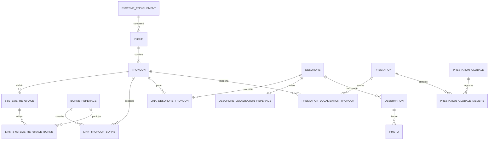

# SIRS — schéma conceptuel PostgreSQL/PostGIS

Version : **0.1 consolidée — 6 septembre 2026**  
Statut : **référence conceptuelle courante**  
Sources consolidées : anciennes versions `schema_conceptuel_postgresql_v0_1.md` à `schema_conceptuel_postgresql_v0_7.md`

## Objet du document

Ce document remplace, comme référence documentaire active, les sept documents de conception successifs produits pendant les premières étapes du développement PostgreSQL/PostGIS.

Ces anciennes versions ont servi à explorer, corriger et préciser le modèle. Elles contiennent donc des hypothèses ensuite abandonnées ou remplacées. Leur historique reste disponible dans Git ; elles ne doivent plus être présentées à l'IA ou à un lecteur comme des sources métier concurrentes.

La présente version constitue la première **baseline conceptuelle consolidée**. Elle décrit les décisions encore valides après les itérations historiques, sans prétendre remplacer le DDL PostgreSQL, les tests de migration ou la documentation détaillée de l'application.

Principes directeurs :

- le modèle historique SIRS Digues/CouchDB reste la référence métier à comprendre et à migrer ;
- PostgreSQL/PostGIS normalise les relations et élimine les sources de vérité concurrentes lorsqu'elles n'ont pas de justification métier ;
- aucune incohérence historique n'est corrigée silencieusement ;
- la géométrie, le repérage terrain et la trace de migration sont des notions distinctes ;
- les conversions spatiales sont déterministes et reçoivent explicitement leur tronçon et leur système de repérage ;
- les transformations structurantes du référentiel sont contrôlées, transactionnelles et auditables ;
- les géométries dérivées ne deviennent pas des secondes géométries métier indépendantes.

---

## 1. Vue d'ensemble du modèle

Le noyau du patrimoine reste organisé autour des systèmes, digues et tronçons. Les objets métier se rattachent ensuite au référentiel de tronçons par des relations explicites et, lorsqu'ils sont réellement géolocalisés, par une géométrie PostGIS.



Ce diagramme est conceptuel. Les noms physiques exacts, les colonnes communes et certaines familles encore non implémentées sont définis par le DDL versionné.

---

## 2. Trois notions spatiales à ne pas confondre

### 2.1 Géométrie cartographique

La géométrie PostGIS représente la position physique actuelle d'un objet sur la carte.

Pour les objets physiques, elle constitue la représentation spatiale principale :

```text
desordre.geometry
ouvrage_hydraulique.geometry
equipement_mesure.geometry
cheminement.geometry
vegetation.geometry
photo.geometry éventuelle
```

Une géométrie peut être un point, une ligne ou un polygone selon la famille métier.

### 2.2 Repérage terrain

Le repérage linéaire exprime une localisation dans le vocabulaire du terrain :

```text
tronçon
+ système de repérage
+ borne
+ distance
+ position relative / sens
+ PR
```

Exemples :

```text
PR 3+420
20 m après une borne dans le sens défini par le système
intervalle PR 3+420 → 3+510
```

Une géométrie XY ne supprime donc pas l'intérêt métier d'un repérage terrain.

### 2.3 Données source de migration

Les valeurs CouchDB telles que `positionDebut`, `positionFin`, PR historiques, modes de géométrie ou diagnostics de conversion peuvent être nécessaires pour comprendre et auditer la migration.

Elles ne deviennent pas automatiquement des colonnes métier permanentes.

Règle générale :

```text
geometry actuelle
≠ repérage terrain
≠ donnée brute/source de migration
```

---

## 3. Autorité : une propriété de l'opération, pas un état permanent

Les premières versions envisageaient une `politique_autorite` persistante (`GEOMETRIE_FIXE`, `REPERAGE_FIXE`, etc.). Cette approche a été remplacée.

Dans le modèle consolidé, **l'autorité dépend de l'opération effectuée**.

### 3.1 Édition cartographique ou par coordonnées

La géométrie saisie fait foi :

1. elle est conservée exactement ;
2. elle n'est pas rabattue automatiquement sur un tronçon ;
3. si l'objet est lié à exactement un tronçon et que son type permet un repérage, celui-ci peut être recalculé depuis la géométrie ;
4. avec zéro ou plusieurs tronçons, aucun repérage longitudinal opérationnel n'est maintenu.

Un point hors axe reste donc hors axe et une ligne libre conserve ses sommets.

### 3.2 Édition explicite du repérage

Lorsque l'utilisateur saisit explicitement borne, distance et position relative, le repérage saisi est autoritaire pour cette opération.

Cette opération exige exactement un tronçon associé.

- pour un point, le repérage reconstruit un point sur le tronçon ;
- pour une ligne, les repérages de début et de fin peuvent reconstruire une sous-ligne du tronçon ;
- ce recalage est volontaire et peut remplacer une géométrie libre antérieure.

Une simple édition cartographique ne doit jamais déclencher ce recalage destructif.

---

## 4. Noyau commun de repérage

Le système de repérage historique SIRS n'est pas supprimé. Il constitue un sous-modèle technique et métier du référentiel de tronçons.

### 4.1 Système de repérage

Conceptuellement :

```text
systeme_reperage
- id
- troncon_id
- libelle
- commentaire
- valid
```

Un système appartient à un tronçon.

Le modèle ne suppose pas :

- qu'un tronçon ne possède qu'un système ;
- qu'un système ne possède que deux bornes ;
- que les PR commencent à zéro ;
- que les PR sont égaux aux mètres depuis le premier sommet ;
- que l'ordre des PR suit le sens géométrique du `LineString`.

### 4.2 Bornes de repérage

Une borne est un objet ponctuel autonome :

```text
borne_reperage
- id
- libelle
- geometry Point
- fictive
- valid
- dates éventuelles
```

Une borne peut être partagée par plusieurs tronçons ou systèmes.

Elle n'est pas assimilée par principe à une extrémité du tronçon.

### 4.3 Relation tronçon–borne

La relation physique entre tronçon et borne est indépendante de l'utilisation de la borne dans un système :

```text
link_troncon_borne
- troncon_id
- borne_id
```

### 4.4 Relation système–borne et valeur PR

La valeur PR appartient à l'association entre la borne et le système :

```text
link_systeme_reperage_borne
- systeme_reperage_id
- borne_id
- valeur_pr
- valid
```

Règle essentielle :

```text
valeur_pr
≠ propriété absolue de la borne

valeur_pr
= propriété de la borne dans un système donné
```

### 4.5 Système par défaut

Un tronçon peut désigner un système de repérage par défaut.

Ce système sert à préremplir une interface ou proposer un choix. Il ne doit jamais être utilisé silencieusement par une fonction de conversion qui a reçu un autre système.

---

## 5. Moteur canonique de conversion

Les conversions fondamentales doivent être déterministes et recevoir explicitement :

```text
troncon_id
systeme_reperage_id
```

Aucun moteur fondamental ne choisit un tronçon par proximité spatiale.

### 5.1 XY → repérage

Entrées :

```text
troncon_id
systeme_reperage_id
position XY
```

Principe :

1. vérifier la cohérence tronçon/système ;
2. projeter la position sur le tronçon ;
3. calculer l'abscisse curviligne ;
4. identifier une borne de référence du système ;
5. calculer distance et position relative ;
6. calculer le PR dans le même système ;
7. retourner un statut explicite.

L'interface peut proposer des tronçons candidats, mais le rattachement métier n'est pas décidé implicitement par la primitive.

### 5.2 Repérage → XY

Entrées :

```text
troncon_id
systeme_reperage_id
borne_id
distance_m
position_relative
```

Principe :

1. vérifier la cohérence tronçon/système/borne ;
2. projeter la borne sur le tronçon ;
3. calculer son abscisse ;
4. appliquer le déplacement demandé ;
5. vérifier le domaine du tronçon ;
6. calculer le point XY ;
7. calculer le PR dans le même système.

Aucun rabattement silencieux vers le début ou la fin du tronçon n'est autorisé.

### 5.3 PR → XY

Entrées :

```text
troncon_id
systeme_reperage_id
pr
```

Le calcul utilise les bornes et valeurs PR du système explicitement choisi. Il doit accepter notamment :

- plusieurs bornes ;
- PR ne commençant pas à zéro ;
- PR décroissants dans le sens géométrique ;
- bornes intermédiaires ;
- bornes partagées.

Un système incomplet ou ambigu produit un état explicite, jamais un résultat dépendant de l'ordre de stockage.

### 5.4 Hors domaine

Le comportement par défaut est de refuser un résultat hors domaine.

Un éventuel rabattement ou une extrapolation ne peut être qu'une décision explicite d'une opération spécialisée et auditée.

---

## 6. Désordres : géométrie, rattachement et repérage

### 6.1 Géométrie métier

`desordres.geometry` représente la géométrie physique du désordre.

Dans l'état conceptuel issu du prototype, les types simples suivants sont admis :

```text
Point
LineString
Polygon
```

Les géométries multi-parties ne sont pas introduites à cette étape.

### 6.2 Rattachement N:N aux tronçons

Le rattachement métier reste indépendant de la géométrie :

```text
desordres
N:N
link_desordres_troncons
N:1
troncons
```

Aucun champ `mode_localisation` n'est nécessaire : le nombre de liens détermine le comportement.

### 6.3 Règle 0 / 1 / N

```text
0 tronçon
→ géométrie seule

1 tronçon
→ géométrie + repérage longitudinal possible

N tronçons, N >= 2
→ géométrie + rattachement N:N
→ aucun repérage longitudinal
```

Avec plusieurs tronçons, aucun « tronçon de référence » supplémentaire ne doit être ajouté pour forcer artificiellement un PR.

### 6.4 Localisation opérationnelle des désordres

Le modèle opérationnel spécialisé est :

```text
desordre_localisations_reperage
- id
- desordre_id                 UNIQUE
- troncon_id
- systeme_reperage_id
- borne_debut_id
- distance_debut_m
- position_debut_relative
- offset_debut_m              généré
- pr_debut                    courant
- borne_fin_id                nullable pour Point
- distance_fin_m              nullable pour Point
- position_fin_relative       nullable pour Point
- offset_fin_m                généré
- pr_fin                      courant
- valid
```

Les contraintes doivent garantir la cohérence entre désordre, tronçon, système et bornes.

La relation vers `(desordre_id, troncon_id)` interdit une localisation sur un tronçon auquel le désordre n'est pas lié.

`desordre_id UNIQUE` garantit au plus un repérage, cohérent avec la règle « exactement un tronçon ».

### 6.5 Sens autour d'une borne

Le stockage distingue les positions relatives à la borne. `SUR_BORNE` peut rester accepté pour la compatibilité, mais une distance nulle signifie déjà que le point est sur la borne.

L'interface métier peut simplifier la saisie à Amont/Aval ou Avant/Après selon la convention retenue, à condition que la convention algébrique soit documentée et indépendante de l'orientation hydraulique.

---

## 7. Comportement des désordres selon leur géométrie

### 7.1 Point

- édition cartographique libre ;
- édition X/Y dans le CRS projeté courant ;
- édition longitude/latitude avec transformation vers le CRS projeté ;
- calcul informatif du repérage avec exactement un tronçon ;
- repositionnement sur le tronçon seulement lors d'une édition explicite du repérage.

Les vues X/Y et longitude/latitude représentent la même géométrie et ne constituent pas des colonnes métier indépendantes.

### 7.2 LineString

À la migration historique des `Desordre` :

- `positionDebut` et `positionFin` sont prioritaires lorsqu'elles sont exploitables ;
- des positions identiques produisent un `Point` ;
- des positions différentes produisent normalement une ligne directe A–B ;
- si les deux positions sont pratiquement sur le tronçon explicitement désigné par `linearId`, la migration peut reconstruire la sous-ligne du tronçon selon la règle et la tolérance documentées par le migrateur ;
- aucun autre tronçon n'est choisi par proximité ;
- la géométrie CouchDB reste un fallback lorsque les positions historiques sont inexploitables.

En fonctionnement courant :

- l'édition cartographique conserve la ligne complète ;
- début et fin alimentent le repérage ;
- un recalage explicite par bornes remplace volontairement la ligne par une portion du tronçon.

### 7.3 Polygon

Les désordres historiques SIRS ne sont pas normalement polygonaux. Un polygone historique valide n'est qu'un cas de compatibilité lorsque les positions historiques ne permettent pas une reconstruction normale.

En fonctionnement courant, un polygone est éditable sur la carte mais ne possède pas de repérage longitudinal éditable et ne peut pas être reconstruit depuis une borne ou un PR.

---

## 8. Tronçons composites

Un tronçon composite est un **tronçon ordinaire et indépendant** de `troncons`.

Il possède sa propre géométrie, sa digue, ses systèmes de repérage et ses bornes.

Il n'existe pas :

- de table d'agrégats ;
- de relation de composition obligatoire avec les tronçons qu'il recouvre ;
- d'union dynamique servant de géométrie au composite.

Un composite peut donc recouvrir des tronçons plus courts ou parallèles sans ambiguïté pour les conversions, puisque celles-ci exigent toujours un `troncon_id` explicite.

Un objet utilisant un tronçon composite doit être lié au composite lui-même, et non simultanément aux tronçons courts plus à un pseudo-tronçon de référence.

---

## 9. Prestations : objet métier et localisation linéaire

Une prestation est distincte de son emprise. Elle peut :

- n'avoir aucune emprise linéaire ;
- couvrir tout ou partie d'un tronçon ;
- couvrir plusieurs tronçons ;
- être reliée indépendamment à des désordres, ouvrages ou équipements.

Les liens vers les objets concernés ne doivent pas servir à déduire son emprise spatiale.

### 9.1 `prestation_localisation_troncon`

La localisation métier de référence d'une prestation linéaire est :

```text
prestation_localisation_troncon
- prestation_id
- troncon_id
- troncon_entier
- debut_m
- fin_m
```

Chaque ligne représente une portion d'un tronçon.

Pour une portion :

```text
troncon_entier = false
debut_m IS NOT NULL
fin_m IS NOT NULL
0 <= debut_m <= fin_m <= longueur du tronçon
```

Pour le tronçon entier :

```text
troncon_entier = true
debut_m = NULL
fin_m = NULL
```

Cette dernière représentation évite de figer l'ancienne longueur du tronçon.

### 9.2 Prestations multi-tronçons

Une prestation couvrant plusieurs tronçons possède plusieurs lignes de localisation.

Chaque ligne décrit soit :

- un tronçon entier ;
- une portion de tronçon.

### 9.3 Géométrie dérivée

La table de localisation ne porte pas de géométrie métier éditable.

La géométrie affichée est calculée depuis :

```text
troncon.geometry
+ troncon_entier / debut_m / fin_m
→ géométrie courante de la prestation
```

Aucune `geometry_realisation` figée n'est introduite dans le modèle cible.

Une correction géométrique du même tronçon entraîne donc un recalcul de la représentation de la prestation.

QGIS ne doit pas éditer cette géométrie dérivée comme une source indépendante.

### 9.4 Migration des prestations

Les valeurs historiques `prDebut` et `prFin` ne sont jamais copiées directement dans `debut_m` et `fin_m`.

La conversion doit résoudre explicitement le tronçon et le système de repérage, reconstruire la position physique, puis en déduire l'intervalle métrique normalisé.

---

## 10. Prestations globales et relations métier

La relation entre prestation globale et prestation simple est indépendante de la localisation :

```text
prestation_globale_membre
- prestation_globale_id
- prestation_id
```

Les associations plusieurs-à-plusieurs deviennent des tables de liaison canoniques, notamment pour :

```text
prestation ↔ désordre
prestation ↔ ouvrage particulier
prestation ↔ ouvrage hydraulique
prestation globale ↔ prestation simple
prestation ↔ intervenant
```

Une sélection groupée dans l'interface correspond à plusieurs insertions relationnelles dans une transaction ; elle ne justifie pas un stockage sous forme de tableau d'identifiants.

La question de savoir si une prestation globale peut porter une emprise métier propre, distincte de l'union de ses membres, reste à valider par le métier. Le modèle consolidé ne lui impose pas une localisation dupliquée.

---

## 11. Observations et photos

### 11.1 Observations

Une observation documente son objet métier parent. Elle ne reçoit une géométrie propre que si elle est réellement localisée indépendamment de cet objet.

Le modèle relationnel doit préserver des clés étrangères contrôlables ; une référence polymorphe non contrainte n'est pas la cible privilégiée.

### 11.2 Photos

Le modèle cible normalise la chaîne documentaire vers :

```text
objet métier
→ observation
→ photo
```

Une photo peut toutefois porter sa propre géométrie ou des informations de localisation lorsque celles-ci existent réellement dans la source.

La localisation propre d'une photo ne doit pas être remplacée automatiquement par celle de son parent.

Le chemin opérationnel du fichier photo n'est pas une simple trace de migration.

---

## 12. Ouvrages, équipements, réseaux, cheminements et mobilier

Ces familles sont des objets physiques lorsqu'elles possèdent une géométrie propre.

La géométrie PostGIS reste alors leur représentation cartographique principale.

Le noyau de systèmes et de bornes est générique et réutilisable, mais le modèle opérationnel de localisation longitudinale n'est pas généralisé artificiellement à toutes les familles dans la baseline actuelle.

La v0.6 a volontairement spécialisé la table et les triggers de repérage sur les désordres. Une extension future aux ouvrages, équipements, réseaux, cheminements, mobilier, photos ou végétation devra reprendre les mêmes invariants :

- tronçon et système explicites ;
- aucune sélection par simple proximité ;
- règle claire pour 0, 1 ou N tronçons ;
- pas de synchronisation bidirectionnelle silencieuse.

Les attributs métier historiques encore sans référentiel cible, notamment certains usages, matériaux, revêtements ou positions de cheminement, ne doivent pas être supprimés sous prétexte que leur nom contient `source`.

---

## 13. Végétation et parcelles de gestion

Une parcelle de végétation peut concerner plusieurs tronçons sans être dupliquée.

Conceptuellement :

```text
parcelle_vegetation
- id
- geometry
- attributs métier

link_parcelle_troncon
- parcelle_id
- troncon_id
```

La géométrie de la parcelle reste sa référence spatiale.

Le repérage longitudinal n'est conservé que lorsqu'il correspond à une vraie information métier et non à une simple valeur dérivée historiquement par SIRS.

---

## 14. Évolution du référentiel de tronçons

Il faut distinguer deux catégories de modification.

### 14.1 Correction géométrique du même tronçon

Exemples : correction de sommets, amélioration du tracé, correction topologique sans changement d'identité ni de sens.

Effets :

- la géométrie propre des objets physiques n'est pas déplacée ;
- leurs repérages éventuels peuvent être recalculés depuis leur géométrie lorsque les conditions de rattachement sont satisfaites ;
- les intervalles de prestations restent attachés au même tronçon ;
- la géométrie dérivée des prestations est recalculée sur le tronçon courant ;
- si une modification rend un intervalle invalide, elle doit être refusée ou traitée explicitement, jamais tronquée silencieusement.

### 14.2 Inversion d'un tronçon

L'inversion est une opération structurante.

Pour le tronçon :

```text
ST_Reverse(troncon.geometry)
```

Pour les désordres :

- leur géométrie physique ne change pas ;
- le repérage des désordres liés uniquement à ce tronçon est recalculé depuis leur géométrie ;
- le rôle spatial des bornes début/fin est recalculé à partir de leur abscisse.

Pour une prestation partielle sur un tronçon de longueur `L` :

```text
nouveau_debut_m = L - ancien_fin_m
nouveau_fin_m   = L - ancien_debut_m
```

Une prestation `troncon_entier = true` reste entière.

### 14.3 Redécoupage

Un redécoupage peut transformer une localisation source en plusieurs localisations cibles.

Il doit :

- connaître explicitement les tronçons source et cibles ;
- conserver exactement l'emprise métier ;
- créer autant de lignes de localisation que nécessaire ;
- vérifier qu'aucune portion n'est perdue ;
- traiter les dépendances avant archivage du tronçon source ;
- être transactionnel et auditable.

### 14.4 Fusion

Plusieurs localisations peuvent être fusionnées seulement si la continuité, l'ordre, le sens et l'absence de vide ou d'ambiguïté sont démontrés.

Aucune fusion silencieuse n'est autorisée.

### 14.5 Remplacement

Le remplacement d'un tronçon change son identité métier et ne doit pas être simulé par une suppression puis une création indépendante.

Il doit porter une correspondance explicite entre source et cible et traiter toutes les dépendances avant archivage.

### 14.6 Atomicité et audit

Une transformation structurante doit constituer une seule opération logique :

```text
modification du référentiel
+ transformation des dépendances
+ contrôles de conservation
+ audit
= COMMIT
```

ou aucun changement.

La suppression en cascade d'une localisation métier qui ferait perdre silencieusement son emprise est exclue.

---

## 15. Migration depuis CouchDB

### 15.1 Principe

La migration ne cherche pas à reproduire mécaniquement chaque champ CouchDB dans PostgreSQL.

Elle distingue :

- les données métier cibles ;
- les valeurs utiles à la conversion ;
- les anomalies historiques ;
- les traces d'audit.

### 15.2 Pas de correction silencieuse

Les incohérences doivent être :

- détectées ;
- classées ;
- consignées ;
- corrigées seulement par une règle démontrée ou une validation humaine.

Une relation réciproque CouchDB n'est jamais copiée deux fois. PostgreSQL construit une relation canonique unique.

### 15.3 Données de migration hors modèle opérationnel

Les informations dont la seule fonction est d'expliquer la migration ne deviennent pas des colonnes du modèle métier opérationnel, par exemple :

```text
pr_debut_source / pr_fin_source
position_debut_source / position_fin_source
systeme_reperage_source_id
mode_saisie_source
politique_autorite
source_document_id
trace_source
diagnostic_conversion
qualite de migration
ordre_source des associations système–borne
```

Le migrateur peut les porter transitoirement et produire des artefacts d'audit JSON, CSV et Markdown.

### 15.4 Géométrie historique des désordres

Pour les désordres historiques, la migration donne priorité aux positions de début et de fin lorsqu'elles sont exploitables, car la géométrie CouchDB peut avoir été projetée ou reconstruite par SIRS.

La géométrie CouchDB reste un fallback de compatibilité lorsque ces positions sont inutilisables.

Aucun tronçon ne doit être choisi par simple proximité lorsque la source fournit un rattachement explicite.

### 15.5 Relations incohérentes

Les associations historiques bidirectionnelles sont réconciliées dans une seule table canonique.

Les paires concordantes peuvent être importées automatiquement. Les paires unilatérales ou contradictoires doivent suivre une règle métier documentée ou être signalées pour contrôle.

---

## 16. Vues, fonctions et opérations SQL

Le modèle cible peut exposer des vues et opérations SQL afin de centraliser les invariants spatiaux.

Pour les désordres, les concepts stabilisés incluent notamment :

```text
view_desordres_points_saisie
→ coordonnées dérivées et édition atomique de la même geometry

view_systemes_reperage_bornes
→ bornes, rôles spatiaux et libellés

view_desordre_localisations_reperage
→ lecture métier du repérage courant

synchroniser_desordre_reperage
→ applique la règle 0/1/N et recalcule depuis la geometry

inverser_troncon
→ opération contrôlée d'inversion
```

Les triggers de cohérence doivent maintenir les invariants sans transformer une édition cartographique ordinaire en recalage longitudinal implicite.

---

## 17. QGIS et interfaces de saisie

QGIS reste un environnement cartographique important du système cible.

Les interfaces doivent exposer les données métier sans rendre les structures normalisées inutilisables.

Principes :

- filtrer les systèmes et bornes selon le tronçon explicitement choisi ;
- afficher les PR et distances calculés sans créer une seconde source de vérité ;
- distinguer une édition de géométrie d'une édition explicite du repérage ;
- empêcher les transformations structurantes de tronçons par une simple édition libre ;
- ne pas dépendre d'un ordre CouchDB historique pour déterminer début et fin ;
- conserver la logique métier fondamentale dans PostgreSQL/PostGIS lorsque cela permet un comportement identique entre clients.

---

## 18. Précision et CRS

### 18.1 Précision

Les valeurs PostgreSQL/PostGIS ne sont pas arrondies pour le stockage métier.

L'arrondi est une question d'affichage. Les prototypes ont retenu à titre d'interface :

- distances et PR : environ 2 décimales ;
- X/Y projetés : environ 2 décimales ;
- longitude/latitude : environ 6 décimales.

### 18.2 SRID

Le prototype consolidé utilise actuellement **EPSG:3950** pour les géométries projetées de l'instance considérée.

Cette valeur n'est **pas** une propriété métier universelle de SIRS.

Le SRID devra devenir paramétrable pour permettre des déploiements dans d'autres territoires et CRS. Cette évolution est transversale au DDL, au migrateur, aux validations SQL, au backend, au frontend, aux tests et à la documentation.

---

## 19. Territoire administratif de l'instance

Le territoire administratif est un ajout propre à la nouvelle application. Il ne provient pas du modèle CouchDB historique et ne fait pas partie de la migration métier.

Il sert de configuration d'instance, notamment pour :

- définir une emprise territoriale de référence ;
- fournir une bbox à des traitements externes futurs ;
- permettre un masque cartographique extérieur au territoire.

### 19.1 Cardinalité singleton

La table représente zéro ou un territoire courant :

```text
territoires_administratifs
- id = 1
- libelle
- geometry Polygon
```

Elle n'est pas historisée :

```text
0 ligne → aucun territoire configuré
1 ligne → territoire courant
```

### 19.2 Contraintes

Dans le prototype actuel :

```sql
id INTEGER PRIMARY KEY DEFAULT 1 CHECK (id = 1)
geometry geometry(Polygon, 3950) NOT NULL
```

La géométrie doit être :

- un `Polygon` ;
- valide ;
- non vide.

`MultiPolygon` n'est pas accepté par ce modèle de configuration et plusieurs entités ne sont pas fusionnées automatiquement à l'import.

---

## 20. Référentiels et intégrité relationnelle

Les valeurs de référence métier doivent être normalisées dans des tables dédiées lorsque cela apporte des contraintes, attributs ou listes de valeurs utiles.

Les tables métier référencent ces tables par clés étrangères plutôt que de recopier librement des libellés lorsque le concept est réellement référentiel.

Principes généraux :

- clés étrangères pour les relations structurantes ;
- unicité des paires dans les tables de liaison ;
- géométries valides ;
- index spatiaux sur les géométries ;
- index adaptés aux clés étrangères et recherches fréquentes ;
- pas de tableaux d'identifiants pour représenter une relation métier N:N ;
- pas de suppression silencieuse de dépendances métier ;
- opérations groupées exécutées dans une transaction.

---

## 21. Décisions consolidées

Les décisions suivantes constituent la baseline actuelle :

1. La géométrie PostGIS est la représentation physique principale des objets réellement géolocalisés.
2. Le repérage linéaire SIRS reste un concept métier et technique utile ; il n'est pas réduit aux prestations.
3. Le noyau systèmes/bornes est conservé indépendamment des tables opérationnelles spécialisées.
4. `valeur_pr` appartient à la relation système–borne.
5. Les conversions reçoivent toujours un tronçon et un système explicites.
6. Le système par défaut d'un tronçon est une aide d'interface, pas une autorité cachée.
7. Aucun tronçon n'est choisi silencieusement par simple proximité dans les conversions fondamentales.
8. L'autorité géométrie/repérage dépend de l'opération ; elle n'est pas un état permanent de l'objet.
9. Pour les désordres, la règle de rattachement est 0 tronçon = pas de repérage, 1 = repérage possible, N >= 2 = pas de repérage longitudinal.
10. Un tronçon composite est un tronçon ordinaire autonome, pas un agrégat dynamique.
11. La localisation opérationnelle actuellement formalisée est spécialisée pour les désordres ; sa généralisation future ne doit pas introduire une abstraction polymorphe incontrôlée.
12. Une édition cartographique conserve la géométrie saisie ; elle ne rabat pas automatiquement l'objet sur le tronçon.
13. Une édition explicite du repérage peut repositionner volontairement l'objet sur le tronçon.
14. Les prestations linéaires utilisent `prestation_localisation_troncon` avec `troncon_entier` ou `debut_m`/`fin_m`.
15. La géométrie des prestations est dérivée du tronçon courant ; aucune `geometry_realisation` figée n'est une source métier.
16. `prDebut`/`prFin` historiques ne sont pas copiés directement dans les distances métriques des prestations.
17. Les relations N:N sont matérialisées par des tables de liaison canoniques.
18. Les anomalies et traces dont la seule fonction est d'expliquer la migration restent dans les artefacts de migration plutôt que dans le modèle opérationnel.
19. Les transformations de tronçons sont explicites, transactionnelles et auditables.
20. Une suppression en cascade ne doit pas faire disparaître silencieusement une localisation métier.
21. Le SRID 3950 est le choix de l'instance/prototype courant, pas une constante universelle de SIRS.
22. Le territoire administratif est une configuration singleton de la nouvelle application et non un objet historique CouchDB.

---

## 22. Points encore ouverts

Cette baseline ne prétend pas résoudre les sujets qui n'ont pas été définitivement tranchés dans les versions sources. Restent notamment à préciser ou à généraliser :

- l'extension du repérage opérationnel des désordres vers les autres familles `Positionable` lorsqu'un besoin métier réel est confirmé ;
- le modèle physique exact de localisation propre des photos ;
- la normalisation complète de certains référentiels encore absents, notamment pour des attributs de cheminement ;
- le comportement complet des prestations globales lorsqu'elles possèdent éventuellement une emprise indépendante de leurs membres ;
- les règles détaillées d'archivage des tronçons, systèmes et bornes lors des redécoupages, fusions et remplacements ;
- les algorithmes et statuts exacts des systèmes de PR incomplets, ambigus ou non élémentaires ;
- la paramétrisation générale du CRS/SRID ;
- les extensions futures au territoire administratif, à l'import cartographique et aux fonctions applicatives qui en dépendent.

Ces sujets doivent être documentés au moment où ils sont effectivement décidés. Ils ne doivent pas être déduits d'une ancienne version exploratoire.

---

## 23. Politique documentaire

À partir de cette consolidation :

```text
Git
→ conserve l'historique des anciennes hypothèses et décisions

schema_conceptuel_postgresql_v0_1.md
→ référence conceptuelle courante

DDL + migrations + tests
→ référence technique exécutable

base PostgreSQL de l'instance
→ vérité sur les données réellement présentes
```

Les anciennes versions `schema_conceptuel_postgresql_v0_1.md` à `v0_7.md` ne doivent donc plus être indexées séparément dans le corpus documentaire actif de l'IA.

Lorsqu'une nouvelle décision conceptuelle majeure est prise, elle doit être intégrée à cette baseline ou donner lieu à une version suivante explicitement identifiée comme référence, plutôt qu'à une accumulation de documents partiellement contradictoires.
